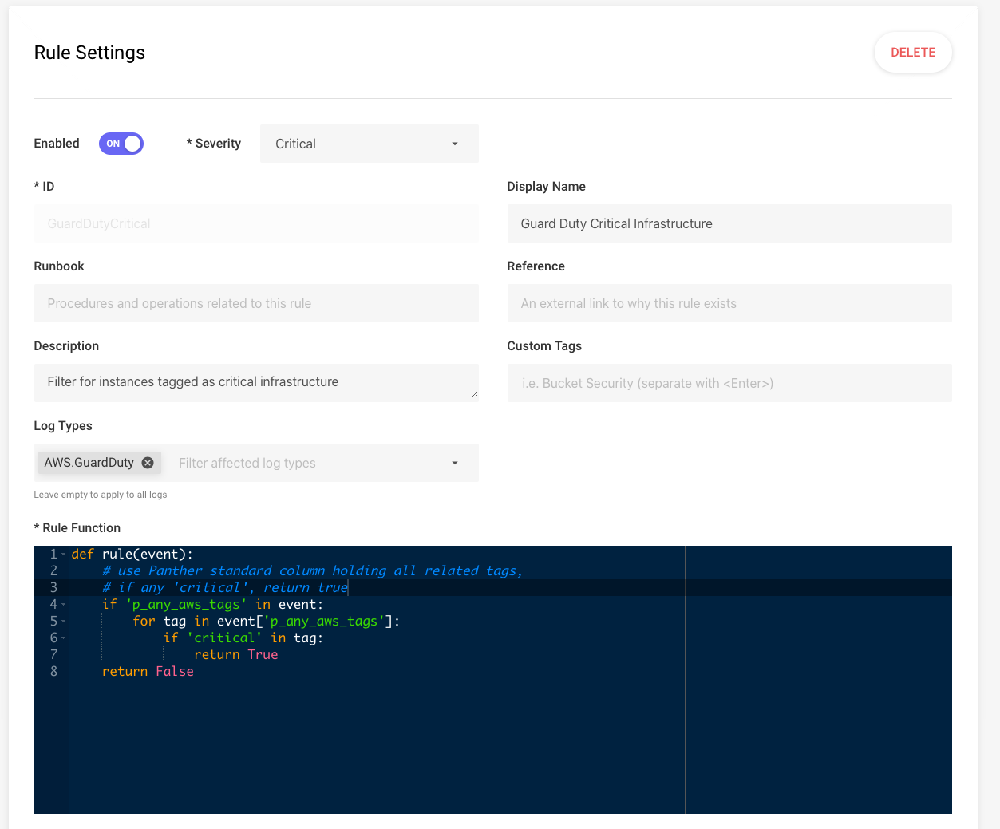

# Panther Fields

Panther log processing appends some fields to all log records.

These fields provide standard names for attributes over all data sources allowing within and between data source correlation of data.

For example, each data source has a name for the time an event occurred but each data source will likely not name the attribute the same nor is it guaranteed that the associated time has a time zone consistent with other data sources.

The Panther attribute `p_event_time` \(described below\) is mapped to each data source's corresponding event time, and normalized to UTC.

In this way you can query over multiple data sources joining and ordering by "p\_event\_time" to properly align and correlate the data despite the disparate schemas of each data source.


All appended standard fields begin with "p\_".


## Required Fields

The fields below are appended to all log records:

| Field Name | Type | Description |
| :--- | :--- | :--- |
| `p_log_type` | `string` | The type of log. |
| `p_row_id` | `string` | Unique id \(UUID\) for the row. |
| `p_event_time` | `timestamp` | The associated event time for the log type is copied here and normalized to UTC. |
| `p_parse_time` | `timestamp` | The current time when the event was parsed normalized to UTC. |


If an event does not have a timestamp, then `p_event_time` will be set to `p_parse_time`, which is the time the event was parsed.


## The "any" Fields

A common security question is often of the form of: “was some-indicator ever observed in our logs?”

Notice that the relationship of the indicator is not a concern initially, simply the presence or absence of activity is of interest.

To allow this question to be answered over all data sources the "any" fields below are appended to rows of data as appropriate.

The `all_logs` Athena view is provided over all data sources to make queries easy for users to find activity for an indicator in a single query.

| Field Name | Type | Description |
| :--- | :--- | :--- |
| `p_any_ip_addresses` | `array<string>` | List of ip addresses \(v4 or v6 in string form\) related to row. |
| `p_any_domain_names` | `array<string>` | List of domain names related to row. |
| `p_any_aws_account_ids` | `array<string>` | List of was account ids related to row. |
| `p_any_aws_instance_ids` | `array<string>` | List of was instance ids related to row. |
| `p_any_aws_arns` | `array<string>` | List of arns related to row. |
| `p_any_aws_tags` | `array<string>` | List of tags related to row as "key:value" pairs. |
| `p_any_md5_hashes` | `array<string>` | List of MD5 hashes related to row. |
| `p_any_sha1_hashes` | `array<string>` | List of SHA1 hashes related to row. |

## The "all\_logs" Athena View

Panther manages an Athena view over all data sources with standard fields.

This allows you to ask questions like "Was there _any_ activity from some-bad-ip and if so where?".

For example this will show how many records by log type that was associated with IP address `95.123.145.92`:

```sql
SELECT
 p_log_type, count(1) AS row_count
FROM panther_views.all_logs
WHERE year=2020 AND month=1 AND day=31 AND contains(p_any_ip_addresses, '95.123.145.92')
GROUP BY p_log_type
```

From this information you can then explore the particular logs where activity is indicated.

## Standard Fields in Rules

The Panther standard fields can be used in rules. For example, this rule triggers when any GuardDuty alert is on a resource tagged as 'critical':



