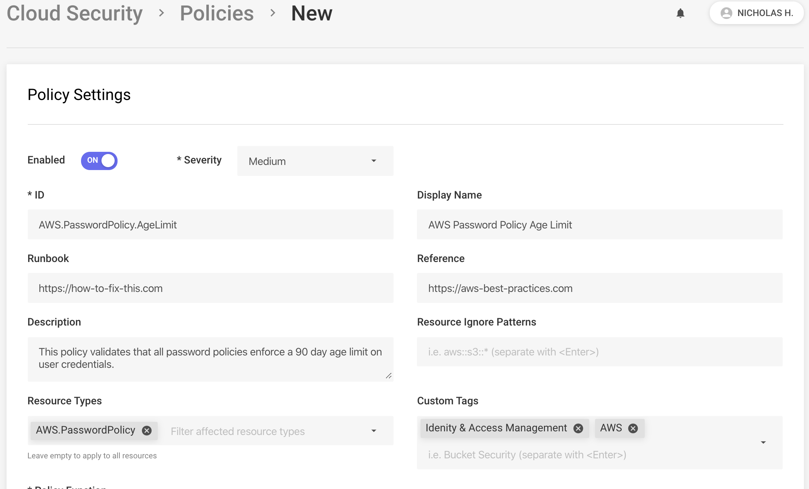
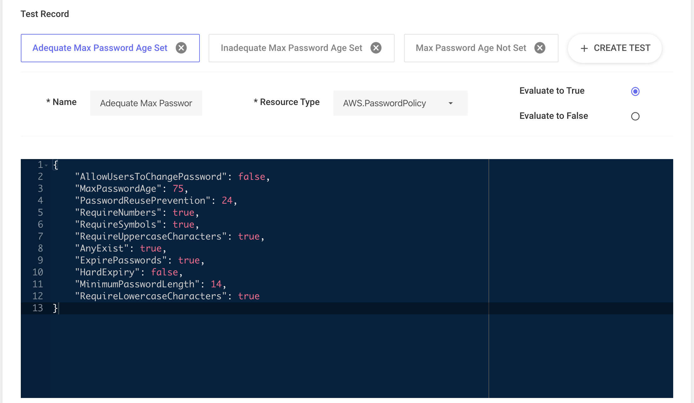
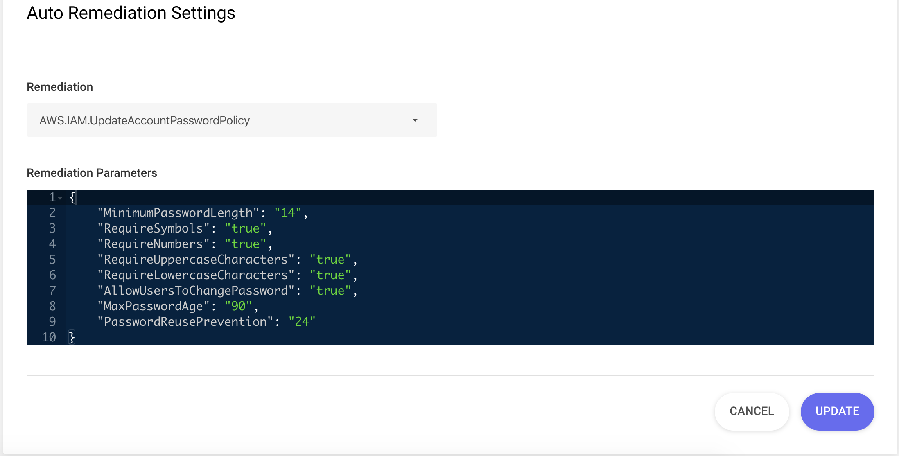

# Policies

Panther enables easy scanning, evaluating, and remediation of cloud infrastructure configuration. **Policies** are Python3 functions used to identify misconfigured infrastructure, generate alerts for your team, and optionally automatically remediate.

## Policy Components

* A `policy` function with a `resource` argument that returns `True` if the resource is compliant and the policy should not send an alert, or `False` if the resource is not complaint and the policy should send an alert
* Optionally, an automatic remediation configuration
* Metadata containing context for triage
* An association with a specific Resource Type

As an example, the policy below checks if an S3 bucket allows public read access:

```python
# A list of grantees that represent public access
GRANTEES = {
    'http://acs.amazonaws.com/groups/global/AuthenticatedUsers',
    'http://acs.amazonaws.com/groups/global/AllUsers'
}
PERMISSIONS = {'READ'}


def policy(resource):
    for grant in resource['Grants']:
        if grant['Grantee']['URI'] in GRANTEES and grant[
                'Permission'] in PERMISSIONS:
            return False

    return True
```

## Policy Packs

By default, policies are pre-installed from Panther's [open-source packs](https://github.com/panther-labs/panther-analysis) and cover baseline detections and examples across supported resource types:

* AWS CIS
* AWS Best Practices

## Policy Writing Workflow

Panther policies can be written, tested, and deployed either with the UI or the [panther\_analysis\_tool](https://github.com/panther-labs/panther_analysis_tool) CLI utility.

Each policy takes a `resource` input of a given resource type from the [supported resources](../resources/) page.

### Policy Body

The policy body MUST:

* Be valid Python3
* Define a `policy()` function that accepts one argument
* Return a `bool` from the policy function

```python
def policy(resource):
  return True
```

The Python body SHOULD:

* Name the argument to the `policy()` function `resource`

The Python body MAY:

* Import standard Python3 libraries
* Import from the user defined `aws_globals` module
* Import from the Panther defined `panther` module
* Define additional helper functions as needed
* Define variables and classes outside the scope of the rule function

Using the schemas in [supported resources](../resources/) provides details on all available fields in resources. Top level keys are always present, although they may contain `NoneType` values.

#### Example Policy

For example, let's write a Policy on an [IAM Password Policy](../resources/aws/password-policy.md) resource:

```javascript
{
    "AccountId": "123456789012",
    "AllowUsersToChangePassword": true,
    "AnyExist": true,
    "ExpirePasswords": true,
    "HardExpiry": null,
    "MaxPasswordAge": 90,
    "MinimumPasswordLength": 14,
    "Name": "AWS.PasswordPolicy",
    "PasswordReusePrevention": 24,
    "Region": "global",
    "RequireLowercaseCharacters": true,
    "RequireNumbers": true,
    "RequireSymbols": true,
    "RequireUppercaseCharacters": true,
    "ResourceId": "123456789012::AWS.PasswordPolicy",
    "ResourceType": "AWS.PasswordPolicy",
    "Tags": null,
    "TimeCreated": null
}
```

This example policy alerts when the password policy does not enforce a maximum password age:

```python
def policy(resource):
    if resource['MaxPasswordAge'] is None:
        return False
    return resource['MaxPasswordAge'] <= 90
```

In the `policy()` body, returning a value of `True` indicates the resource is compliant and no alert should be sent. Returning a value of `False` indicates the resource is non-compliant and an alert or automatic remediation should be sent.

## First Steps with Policies

When starting your policy writing/editing journey, your team should decide between a UI or CLI driven workflow.

Then, configure the built in policies by searching for the `Configuration Required` tag. These policies are designed to be modified by you, the security professional, based on your organization's business logic.

## Writing Policies in the Panther UI

Navigate to Cloud Security &gt; Policies, and click `Create New` in the top right corner. You have the option of creating a single new policy, or uploading a zip file containing policies created with the `panther_analysis_tool`. Clicking single will take you to the policy editor page.


### Set Attributes

Keeping with the Password Policy example above, set all the necessary rule attributes:



#### On choosing a severity

There are lots of standards on what different severity levels should mean. At Panther we base our severities off of this table:

| Severity | Exploitability | Description | Examples |
| :--- | :--- | :--- | :--- |
| `Info` | `None` | No risk, simply informational | Name formatting, missing tags. General best practices for ops. |
| `Low` | `Difficult` | Little to no risk if exploited | Non sensitive information leaking such as system time and OS versions. |
| `Medium` | `Difficult` | Moderate risk if exploited | Expired credentials, missing protection against accidental data loss, encryption settings, best practice settings for audit tools. |
| `High` | `Moderate` | Very damaging if exploited | Large gaps in visibility, directly vulnerable infrastructure, misconfigurations directly related to data exposure. |
| `Critical` | `Easy` | Causes extreme damage if exploited | Public data or systems, leaked access keys. |

Feel free to use this as a reference point, or create your own standards.

### Write Policy Body

Then write our policy logic in the `policy()` function.


### Configure Tests

Next, configure test cases to ensure our policy works as expected:



### Configure Automatic Remediation

From the `Remediation` dropdown, select the remediation you wish to enable for this policy. Some remediations may support or require configurations to be set. On the following pages, you will find more detailed descriptions of each available remediation and their configuration settings.



Now, all future failures of the policy will automatically be re-mediated with the selected remediation. In order to apply the remediation to already detected failures, you can select the `Remediate` button on a failing resource when viewing the resources for the policy.


In order to apply the remediation to all currently failing resources, simply disable the policy then re-enable the policy to re-evaluate all resources immediately with the automatic remediation in place. Panther doesn't do this automatically for safety reasons. This way you are able to enable an automatic remediation, test it out on a few resources to make sure everything is working as intended, then apply it to all failing resources \(if desired\) with the confidence that the exact policy and remediation configurations you intend to carry out are working as intended.

Once you have selected and configured the appropriate remediation, click the `Update` button. Now, all existing `AWS.PasswordPolicy` resources are evaluated by this new policy immediately, and any new Password Policy resources that are discovered will be evaluated as well.

## Writing Policies with the Panther Analysis Tool

The `panther_analysis_tool` is a Python command line interface for testing, packaging, and deploying Panther Policies and Rules. This enables teams to work in a more developer oriented workflow and track detections with version control systems such as `git`.

### Installation

The `panther_analysis_tool` is available on pip!

Simply install with:

```bash
pip3 install panther-analysis-tool
```

### Running Tests

```bash
panther_analysis_tool test --path <path-to-python-code>
```

### Uploading to Panther

Make sure to configure your environment with valid AWS credentials prior to running the command below.

```bash
panther_analysis_tool upload --path <path-to-your-policies> --out tmp
```


Policies with the same ID are overwritten. Locally deleted policies will not automatically delete in the policy database and must be removed manually.


### File Organization

Navigate to the repository/path for your custom detections. We recommend grouping detections based on purpose, such as `s3_policies` or `internal_pci`. Use the open source [Panther Analysis](https://github.com/panther-labs/panther-analysis) packs as a reference.

Each new policy consists of a Python file \(`<my-policy>.py`\) containing your policy function, and a YAML/JSON specification \(`<my-policy>.yml`\) with policy attributes.

### Policy Body

Write your policy as you would above, and save it as `folder/my_new_policy.py`.

### Policy Attributes

The specification file MUST:

* Be valid JSON/YAML
* Define an `AnalysisType` field with the value `policy`

Define the additional following fields:

* `Enabled`
* `FileName`
* `PolicyID`
* `ResourceTypes`
* `Severity`

An example specification file:

```text
AnalysisType: policy 
Enabled: true
Filename: my_new_policy.py
PolicyID: Category.Type.MoreInfo
ResourceType:
  - Resource.Type.Here
Severity: Info|Low|Medium|High|Critical
DisplayName: Example Policy to Check the Format of the Spec
Tags:
  - Tags
  - Go
  - Here
Runbook: Find out who changed the spec format.
Reference: https://www.link-to-info.io
```

The complete list of accepted fields for the policy specification file are detailed below.

| Field Name | Required | Description | Expected Value |  |  |  |  |
| :--- | :--- | :--- | :--- | :--- | :--- | :--- | :--- |
| `AnalysisType` | Yes | Indicates whether this specification is defining a policy or a rule | The string `policy` or the string `rule` |  |  |  |  |
| `Enabled` | Yes | Whether this policy is enabled | Boolean |  |  |  |  |
| `FileName` | Yes | The path \(with file extension\) to the python policy body | String |  |  |  |  |
| `PolicyID` | Yes | The unique identifier of the policy | String |  |  |  |  |
| `ResourceTypes` | Yes | What resource types this policy will apply to | List of strings |  |  |  |  |
| `Severity` | Yes | What severity this policy is | One of the following strings: \`Info | Low | Medium | High | Critical\` |
| `ActionDelaySeconds` | No | How long \(in seconds\) to delay auto-remediations and alerts, if configured | Integer |  |  |  |  |
| `AlertFormat` | No | Not used at this time | NA |  |  |  |  |
| `AutoRemediationID` | No | The unique identifier of the auto-remediation to execute in case of policy failure | String |  |  |  |  |
| `AutoRemediationParameters` | No | What parameters to pass to the auto-remediation, if one is configured | Map |  |  |  |  |
| `Description` | No | A brief description of the policy | String |  |  |  |  |
| `DisplayName` | No | What name to display in the UI and alerts. The `PolicyID` will be displayed if this field is not set. | String |  |  |  |  |
| `Reference` | No | The reason this policy exists, often a link to documentation | String |  |  |  |  |
| `Runbook` | No | The actions to be carried out if this policy fails, often a link to documentation | String |  |  |  |  |
| `Tags` | No | Tags used to categorize this policy | List of strings |  |  |  |  |
| `Tests` | No | Unit tests for this policy. | List of maps |  |  |  |  |

#### Automatic Remediation

Automatic remediations require two fields to be configured in the spec file. The first field is `AutoRemediationID`, and is used to identify the automatic remediation you wish to enable. The second parameter is `AutoRemediationParameters`, which is a dictionary containing the expected configurations for the remediation. For a complete list of remedations and their assocciated configurations, see the [remediations](https://github.com/panther-labs/panther/tree/2a2b2940e1d3702e37ce71125c1d0eed4ab284fc/docs/gitbook/policies/automatic-remediation/aws/README.md) page.

#### Unit Tests

In our spec file, add the following key:

```text
Tests:
  -
    Name: Name to describe our first test.
    ResourceType: Resource.Type.Here
    ExpectedResult: true/false
    Resource:
      Key: Values
      For: Our Resource
      Based: On the Schema
```

## Runtime Libraries

Python provides high flexibility in defining your policies, and the following libraries are available to be used in Panther's runtime environment:

| Package | Version | Description | License |
| :--- | :--- | :--- | :--- |
| `boto3` | `1.10.46` | AWS SDK for Python | Apache v2 |
| `policyuniverse` | `1.3.2.1` | Parse AWS ARNs and Policies | Apache v2 |
| `requests` | `2.22.0` | Easy HTTP Requests | Apache v2 |

To add more libraries, edit the `PipLayer` below in the `panther_config.yml`:

```yaml
PipLayer:
  - boto3==1.11.16
  - policyuniverse==1.3.2.1
  - requests==2.22.0
```

Alternatively, you can override the runtime libraries by attaching a Lambda layer in the `panther_config.yml`:

```yaml
BackendParameterValues:
  PythonLayerVersionArn: 'arn:aws:lambda:us-east-2:123456789012:layer:my-layer:3'
```

## Policy Writing Tips

### Constructing test resources

Manually building test cases is tedious and error prone. We suggest one of two alternatives:

1. Open `Cloud Security` &gt; `Resources`, and apply a filter of the resource type you intend to emulate in your test. Select a resource in your environment, and on the `Attributes` card you can copy the full JSON representation of that resource by selecting copy button next to the word `root`.
2. Open the Panther [Resources documentation](../resources/), and navigate to the section for the resource you are trying to emulate. Copy the provided example resource.

Paste this in to the resource editor if you're working in the web UI, or into the `Resource` field if you are working locally. Now you can manually modify the fields relevant to your policy and the specific test case you are trying to emulate.

Option 1 is best when it is practical, as this can provide real test data for your policies. Additionally, it is often the case that you are writing/modifying a policy specifically because of an offending resource in your account. Using that exact resource's JSON representation as your test case can guarantee that similar resources will be caught by your policy in the future.

### Debugging exceptions

Debugging exceptions can be difficult, as you do not have direct access to the python environment running the policies.

When you see a policy that is showing the state `Error` on a given resource, that means that the policy threw an exception. The best method for troubleshooting these errors is to use option 1 in the **Constructing test resources** section above and create a test case from the resource causing the exception.

Running this test case either locally or in the web UI should provide more context for the issue, and allow you to rapidly modify the policy to debug the exception without having to run the policy against all resources in your environment.

